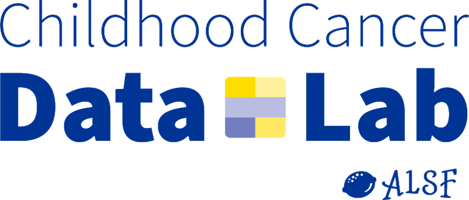

 

The <b><a href="https://www.ccdatalab.org/" title="Alex's Lemonade Stand Foundation">Childhood Cancer Data Lab (Data Lab)</a></b> develops tools and training programs to empower childhood cancer researchers to utilize  data to make more robust discoveries.
The Childhood Cancer Data Lab is an initiative of <b><a href="https://www.alexslemonade.org/" title="Alex's Lemonade Stand Foundation">Alex's Lemonade Stand Foundation</a></b>.

We will introduce concepts in reproducible computational research for genomics, including tools and approaches for organizing, managing, and sharing your code.

<!-- These sentences will only appear if the workshop is OpenRRP.-->


Participants can choose to continue the workshop and learn how to put their skills to use for the [Open Single-cell Pediatric Cancer Atlas (OpenScPCA)](https://openscpca.readthedocs.io/en/latest/), a pediatric cancer research project organized by the Data Lab.
We will teach you how to contribute and we'll get you completely set up so you can dive right into analysis as soon as the workshop ends!



Before the workshop starts, be sure to visit our [Pre-workshop Setup page](setup_instructions/setup_overview.md) for instructions on preparing your computer for the workshop.
_Completing these setup steps is **required** for full participation in the hands-on activities._

Please also review our [Code of Conduct](code-of-conduct.md).

You will also want to review the [Participant Information](participant_information.md) page for details about the workshop location and other logistics.

**Looking for more?**
We have compiled a set of [useful resources](reproducibility_resources.md) that support reproducible computational research that we recommend for your future reading and exploration!
