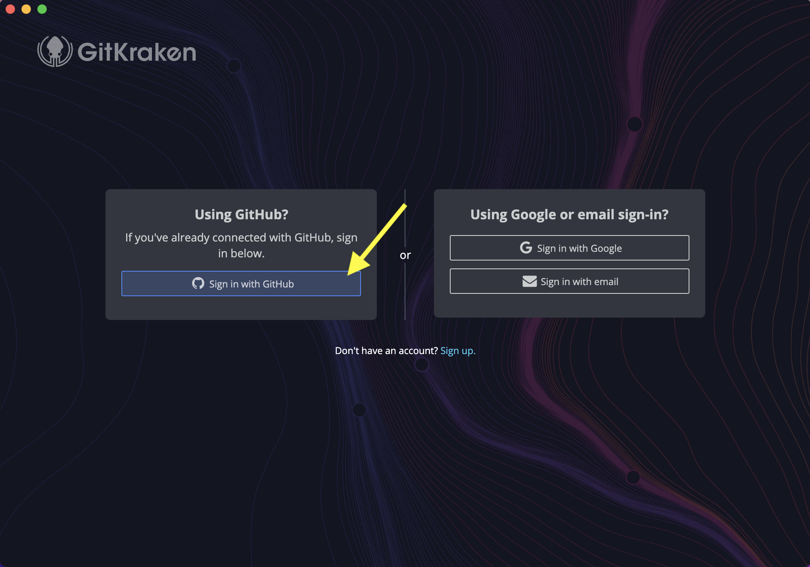
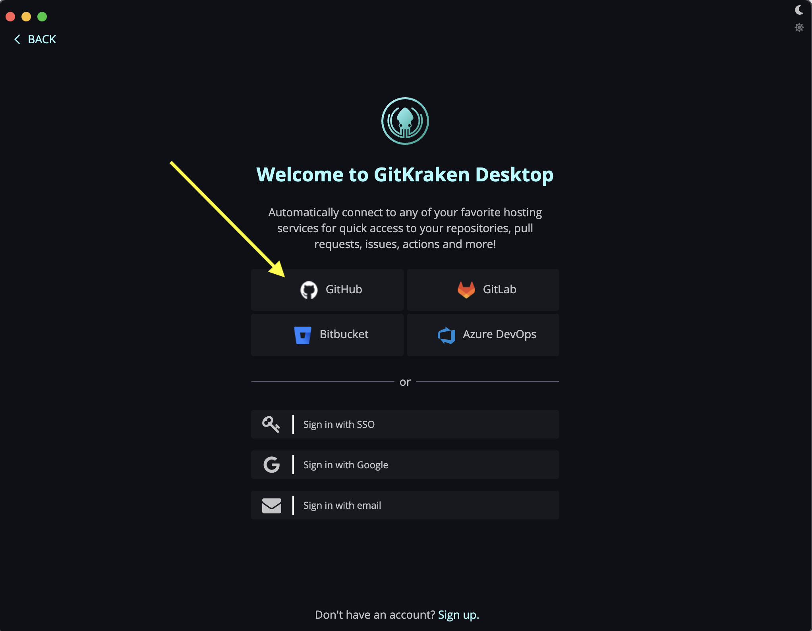
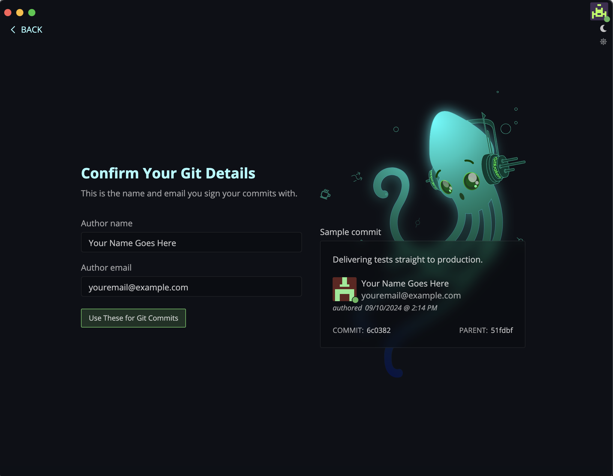
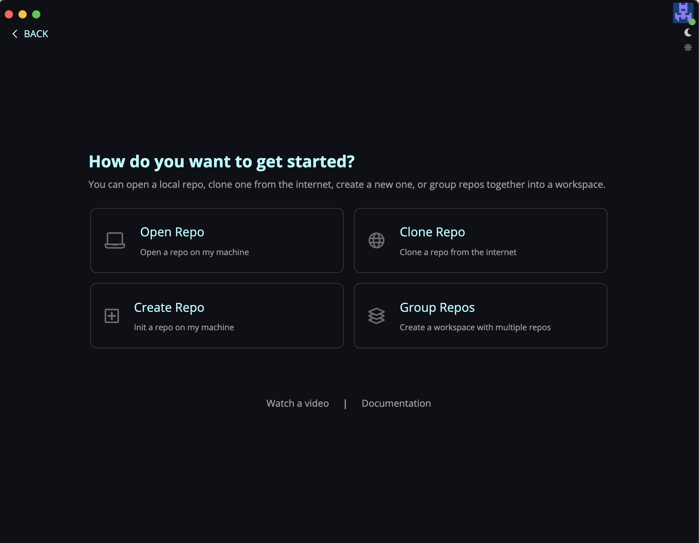

**Table of contents**

* TOC goes here
{:toc}

## Setting up your computer

Before setting up Git and GitKraken, you'll need to follow these steps to install certain softwares on your computer: [Setup for macOS users](./mac_installation_instructions.html) or [Setup for Windows/PC users](./windows_installation_instructions.html).

## Creating a GitHub account

Navigate in the browser to <https://github.com>, and click "Sign Up" in the top-right corner.

GitHub will then lead you through a series of (outer space-themed!) setup prompts, beginning with your email, password, and username, as shown here for example:

After you have filled the required information, GitHub will send the email you provided a one-time code for verification, which you can enter on the next screen.

Next, GitHub will prompt you to fill out certain **Optional** personalization settings.
You can skip this if you prefer (yellow arrow below), or you can follow the prompts accordingly.

Finally, you'll zoom through outer space and arrive at your new GitHub home account page:

## Enabling Two-Factor Authentication (2FA) on GitHub

> Please do NOT skip this step! It is a necessary security setting.

From the top-right corner Account dropdown icon (looks like weirdly arranged squares), click on "Settings."

From the left-hand menu, select "Password and Authentication."
Note, you can also take this moment to fill in your GitHub Public Profile, including your public-facing name, picture, email, bio, any anything else you like.

Click the large green button to "Enable two-factor authentication":

You will then see several options for what _type_ of 2FA you can set up.
_For the best security, we **strongly** recommend that you click "Set up using an app."_
_The only reason not to choose this option is if you do not have a smartphone._
This action requires that you install a separate app on your smart phone to generate authentication codes if you don't already have one.
There are many authenticator app options, including the ones listed by GitHub (1Password, Authy, etc.) or others like Google Authenticator.
Take a moment to either download a preferred 2FA app on your smartphone, or open a 2FA app if you already have one on your smartphone.

Click "Continue" to proceed with setup.

-------

**2FA with an Authenticator App**

After clicking "Continue,", you will see a QR code to scan _into your smartphone app_ (or click "enter this text code" if you prefer not to use the QR code with camera).

Once your QR code is scanned into the app, the app will provide you with a 6-digit code to enter back into github.com.

**2FA with SMS**

After clicking "Continue," you should enter your cell phone number and click "Send authentication code."

Shortly after, you will receive a text message with a 6-digit code which you should enter into the field "Enter the code sent to your phone."

----

Github.com will now show you a list of **recovery codes** that you can use in case you lose access to your phone or authenticator app.
**Save these codes in a secure location, and do NOT share them, just like passwords!**
(This is why the screenshot below blacks out the recovery codes - they should not be shared!)
You can export these code by clicking the "Download" button.

Once you have saved your recovery codes to a secure location, click "I have saved my recovery codes."

Celebrate your new 2FA setup!

## Setting up GitKraken

Now that you have set up your GitHub account, you are ready to configure the GitKraken application you previously downloaded onto your computer.

Open the installed GitKraken application.
Note that if this is the first time you are opening GitKraken on a Mac, you may see this message; click "Open" if you see this message.

When GitKraken first opens, it will prompt you to either open a repository or sign in.
GitKraken's parent company Axosoft has its own account system to manage use of the advanced features of its software.
Luckily, it is easy enough to use your GitHub account to login, which will save you from having to remember a separate login, so we recommend that option.

Click "Sign In":

GitKraken will then present different options for signing in.
Click the "GitHub" icon to proceed to proceed with the authorization process that will link your GitHub account to your GitKraken application.

GitKraken will then open a browser window to link your GitHub account.
If you are not already signed into GitHub, you first will be prompted to log in.

Once you are logged in, you should grant GitKraken permission to link with your GitHub account.
Click "Authorize Axosoft":

You will be redirected to a website confirming that you successfully linked GitHub and GitKraken.

Back in GitKraken, you will now be prompted for your name and email address used for Git commits.
Fill out the information as follows, and then click "Use These for Git Commits".

- `Author Name`: Enter the preferred name you wish to be publicly associated with the actions you'll perform on GitHub.
- `Author Email`: Enter the preferred email you wish to be publicly associated with the actions you'll perform on GitHub.
This email does not have to be the same as the one you used to sign up for GitHub.

Finally, GitKraken will present this screen of options, which means you're all set up!
You do not need to select any options here - we will do that together in the workshop.
You can now safely close GitKraken.

