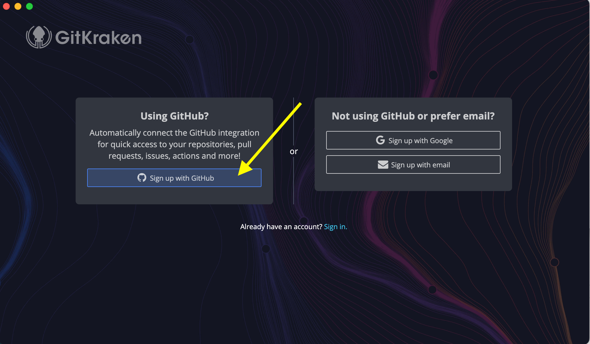

**Table of contents**

* TOC goes here
{:toc}

## Setting up your computer

Before setting up `git` and GitKraken, you'll need to follow these steps to install certain softwares on your computer: [Setup for macOS users](./mac_installation_instructions.html) or [Setup for Windows/PC users](./windows_installation_instructions.html).

## Creating a GitHub account

Navigate in the browser to <https://github.com>, and click "Sign Up" in the top-right corner.

GitHub will then lead you through a series of (outer space-themed!) setup prompts, beginning with your email, password, and username, as shown here for example:

After you have filled the required information, GitHub will send the email you provided a one-time code for verification, which you can enter on the next screen.

Next, GitHub will prompt you to fill out certain **Optional** personalization settings.
You can skip this if you prefer (yellow arrow below), or you can follow the prompts accordingly.

Finally, you'll zoom through outer space and arrive at your new GitHub home account page:

## Enabling Two-Factor Authentication (2FA) on GitHub

> Please do NOT skip this step! It is a necessary security setting.

From the top-right corner Account dropdown icon (looks like weirdly arranged squares), click on "Settings."

From the left-hand menu, select "Password and Authentication."
Note, you can also take this moment to fill in your GitHub Public Profile, including your public-facing name, picture, email, bio, any anything else you like.

Click the large green button to "Enable two-factor authentication".

The next steps require you to enable 2FA with an authenticator app.
This requires that you install a separate app on your smart phone to generate authentication codes if you don't already have one.
There are many authenticator app options, including the ones listed by GitHub (1Password, Authy, etc.) or others like Google Authenticator.
Take a moment to either download a preferred 2FA app on your smartphone, or open a 2FA app if you already have one on your smartphone.

Scan the displayed QR code into your smart phone app, and the app will provide you with a 6-digit code to enter back into GitHub.com.

Github.com will now show you a list of **recovery codes** that you can use in case you lose access to your phone or authenticator app.
**Save these codes in a secure location, and do NOT share them, just like passwords!**
You can export these code by clicking the "Download" button.

Once you have saved your recovery codes to a secure location, click "I have saved my recovery codes."

## Setting up GitKraken

Now that you have set up your `git` account, you are ready to configure the GitKraken application you previously downloaded onto your computer.

Open the installed GitKraken application.
Note that if this is the first time you are opening GitKraken on a Mac, you may see this message; click "Open" if you see this message.

When GitKraken opens, it will first prompt you to sign up for GitKraken.
GitKraken's parent company Axosoft has its own account system to manage use of the advanced features of its software.
Luckily, it is easy enough to use your GitHub account to login, which will save you from having to remember a separate login, so we recommend that option.

Click the link to "Sign up with GitHub:"

Your browser will then open for you to proceed with the authorization process that will link your GitHub account to your GitKraken application.
Click "Continue Authorization" on this website.

If you are _not_ already signed into GitHub in your browser, you will then be prompted to sign into GitHub:

Next, you will have to grant GitKraken permission to link with your GitHub account.
Click "Authorize Axosoft:"

Finally, you will be redirected to a website confirming that you successfully linked GitHub and GitKraken:

When you return to GitKraken, you may be prompted to activate a free trial of GitKraken and to agree to the license.
We will only be using the free features of GitKraken during the workshop, so don't worry about when the trial will expire.
(The paid version adds a number of advanced features, the most useful of which is probably the ability to interact with private repositories on GitHub.)

After agreeing to the GitKraken license, you will be prompted to set up your profile.
Choose your favorite avatar, and add information as follows:

- `Profile Name`: We recommend leaving this at its default, "Default Profile"
- `Author Name`: Enter the preferred name you wish to be publicly associated with the actions you'll perform on GitHub.
- `Author Email`: Enter the preferred email you wish to be publicly associated with the actions you'll perform on GitHub. This email does not have to be the same as the one you used to sign up for GitHub.

Click create profile, and on the following screen select to open a "Repo Tab:"

Finally, you'll arrive on the GitKraken application's home view, and you're all set!

