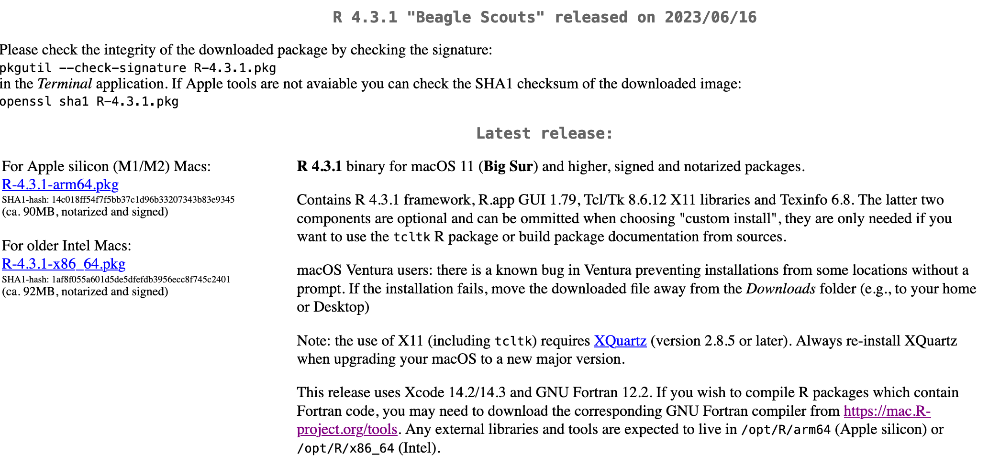
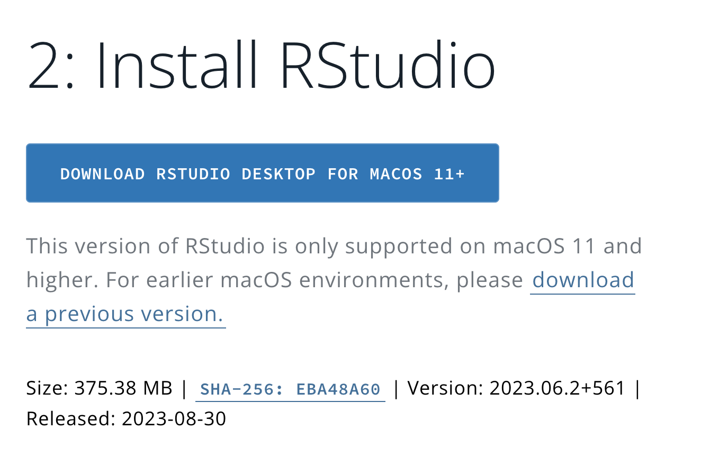

**Table of contents**

* TOC goes here
{:toc}


## Apple Command Line Tools

Apple provides a suite of "command line tools" to facilitate computer programming, and these tools include Git which we will use for this workshop.
To install the command line tools, you will need to open the **Terminal** application.
You can find the Terminal app with a few different approaches:

+ Search for "Terminal" in Spotlight:

  


+ From Finder, navigate to the "Applications" folder, then the "Utilities" folder, and open Terminal from there:

  

+ Use Launchpad and search for Terminal:


  

  


> A note on using Terminal: Terminal will likely (and often when you first start using it!) prompt you with messages like, "Terminal would like to access files on Desktop."
> If/when you see this message, _always agree_!
> Agreeing allows your Terminal to access your computer's file system.

When Terminal is open, type `xcode-select --install` into the Terminal and press Enter, which will reveal a message as follows:


Alternatively, if you see the following message, this means you have previously installed command line tools and are all set with this section!


Shortly after, a separate window will pop up prompting you to install command line tools, where you should click `Install`:


A license agreement will then appear, which you should `Agree` to in order to continue with the installation.
Finally, command line tools will install, and you can follow its progress in this window that will appear.
This screen tends to first appear with outrageous installation times, like 165 hours (!) below.
**Don't panic!**
These outrageous times will drop quickly, and the whole process will _really_ take about 10-20 minutes.


## R and RStudio

This workshop does not require a specific R or RStudio version.
If you already have R and RStudio installed, you can skip this section!

### Installing R

First, navigate to the CRAN website in the browser: <https://cran.r-project.org/>.
Click the link `Download R for macOS`:


On the next page, click the link to install either `R-4.3.1-arm64.pkg` for M1/M2 Macs, or `R-4.3.1-x86_64.pkg` for Intel Macs.





Open the downloaded R installer, and follow instructions to install R onto your computer.
Make sure to agree to the license in the setup menu and give your computer's password when prompted!


#### An alternative installation approach

Instead of manually downloading R, we in the Data Lab have enjoyed using the command-line software [`rig`](https://github.com/r-lib/rig) to manage different versions of R.
If you are comfortable with command-line software, you are welcome to install `rig` and use it to install your preferred R version.

### Installing the RStudio IDE


First, navigate to the RStudio website's Download page in the browser: <https://posit.co/download/rstudio-desktop/#download>.
Click the large link to Download RStudio for Mac:



Open the downloaded RStudio installer, and follow instructions to install it onto your computer.
Once the installation process is completed, you can now safely delete (eject) the disk image file.

### Installing necessary R packages

For this workshop, you will need to have the following R packages installed:

* `here`
* `optparse`
* `renv`
* `rmarkdown`
* `tidyverse`

If you already have these packages installed, you're good to go!


Otherwise, open RStudio (this assumes both R and RStudio have been installed).
You can check if these packages are installed by scrolling through the `Packages` tab in the bottom-right pane of RStudio.
If you see the package of interest listed, then you know it's installed.
For example, the image below tells us that `optparse` is already installed and no additional action is required to install this package:


If you need to install any of the required packages, use the function `install.packages()` in Console, as follows:

```sh
# Install optparse only, for example:
install.packages("optparse")

# Install all necessary packages at once:
install.packages(c("here", "optparse", "renv", "rmarkdown", "tidyverse"))
```

After running this/these command(s), you will see some progress messages pass in Console (maybe in a different color from this image, but that's ok!!).
The following image shows, for example, what these messages look like for a successful installation of `optparse`:


> Note: While installing packages, you may be prompted to install Command Line Tools if you didn't install it already.
> If you see this message, agree to it and follow all installation steps for Command Line Tools.


### Installing Pandoc

As part of this workshop, we'll be working with [R Notebooks](https://bookdown.org/yihui/rmarkdown/notebook.html).
To render these documents to HTML from the command line, you will need a separate piece of software called Pandoc.
(Note that you do not need a separate installation of Pandoc to render these documents from _within RStudio_ - only to render from the command line.)

Follow these instructions to install Pandoc:

1. On the [Pandoc installation page](https://pandoc.org/installing.html), click the link to "Download the latest installer"
2. This will redirect you to the Pandoc GitHub release page, where you should download the installer that matches your computer architecture (where `X.X` is the given release version):
   1. Mac Silicon (M-series) chip users should download **`pandoc-X.X-arm64-macOS.pkg`**
   2. Mac Intel chip users should download **`pandoc-3.4-x86_64-macOS.pkg`**
3. Open the installer and follow instructions to complete installation

## GitKraken

We will use the GUI (graphical user interface) called `GitKraken` to work with Git in this workshop.
This GUI can be installed from <https://www.gitkraken.com>, where you can click "Download GitKraken Desktop Free" (_do not pay!!_).

Then, select the appropriate version for your computer's architecture.
The GitKraken installer will now download.

Double-click the downloaded disk image, and a window will appear where, as the instructions indicate, you should drag the GitKraken icon into the Applications folder icon within this window.


This action completes the installation, and you can now safely delete (eject) the disk image file.
For more information on setting up a GitHub account and the initial GitKraken setup, see our [GitHub Setup instructions](github_gitkraken_setup_instructions.md).


## A suitable text editor

We will use a text editor to write code as part of this workshop, (and more generally, having a good text editor is something you want anyways!).
We recommend [Visual Studio Code ("VS Code")](https://code.visualstudio.com/), but if you already have a text editor you prefer, please feel free to stick with that!
Some alternatives you may have encountered are [Sublime Text](https://www.sublimetext.com/) and [BBEdit](https://www.barebones.com/products/bbedit/).


⚠️ macOS comes with a "text editor" program called "TextEdit."
**In spite of its compelling name, this is _NOT_ a recommend text editor for writing computer code!**
**Please do not use TextEdit!**

### Installing Visual Studio Code

If you choose to  install VS Code, navigate to <https://code.visualstudio.com/download> in the browser.


Click on either "Mac" link to download VS Code.

VS Code will now download as a `.zip` file.
Depending on your browser and settings, this may decompress automatically.
If it does not, open the `.zip` file by double clicking it, and it will decompress to the actual VS Code app called "Visual Studio Code."
You can then drag (or copy) this app file into your computer's `Applications` folder to formally install it.


VS Code is a very powerful program with a ton of ways to customize it.
All of the flexibility can be a tad overwhelming!
There are hundreds of options that affect the program's behavior and hundreds of available extensions which expand its functionality, or just change the way it looks.
We encourage you to explore a bit on your own; we'll be happy to share our favorite tricks during the workshop!
VS Code provides some useful [introductory videos](https://code.visualstudio.com/docs/getstarted/introvideos) as you begin your journey!


**Optional: Install the VS Code command line tool**

One such extension that expands VS Code's function is a command line tool called `code` which you can use to open a file directly from the command line/terminal environment.
(If you are unfamiliar with the command line, we will talk about it during the workshop!)
To install this tool, select the `View > Command Palette...` menu item:


A little text box at the top of your window will then appear.
Start to type `shell` in that box and you will see a menu of options pop up.
Select the one that says `Shell Command: Install 'code' command in the PATH` to install the extension.


You should get a message confirming a successful install, and then you will be all set!


