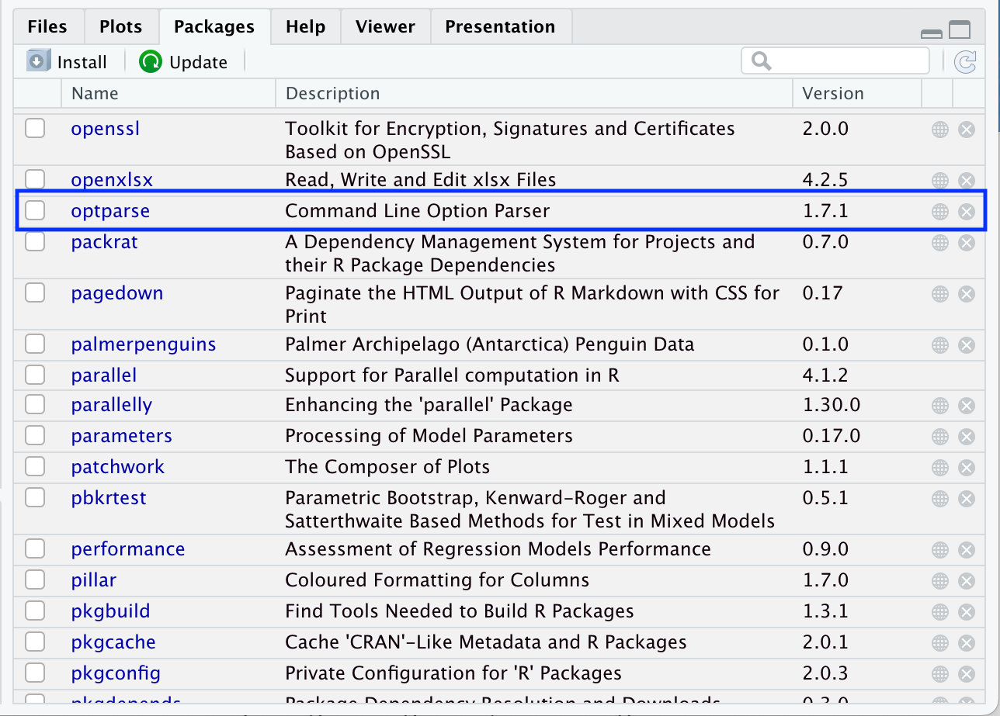
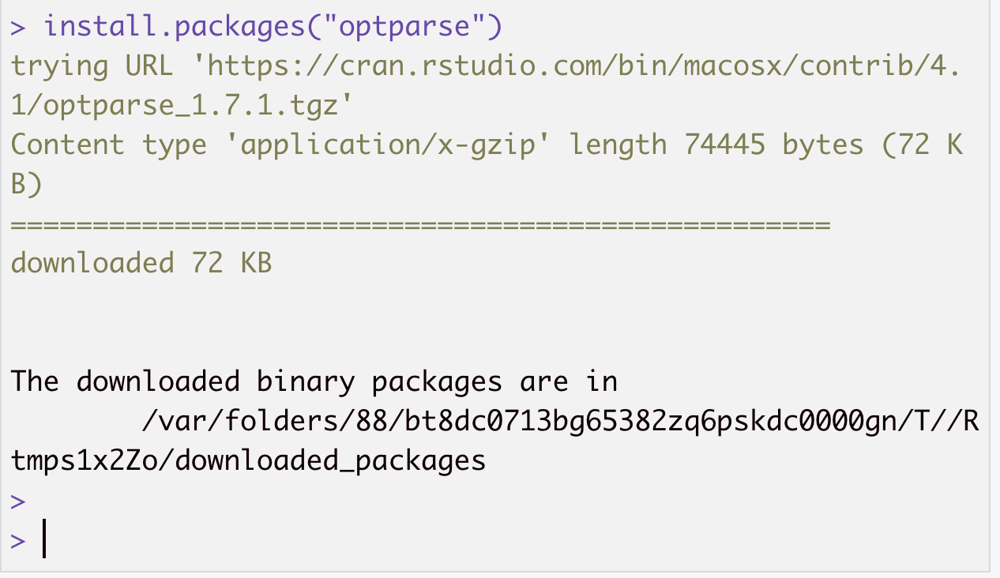
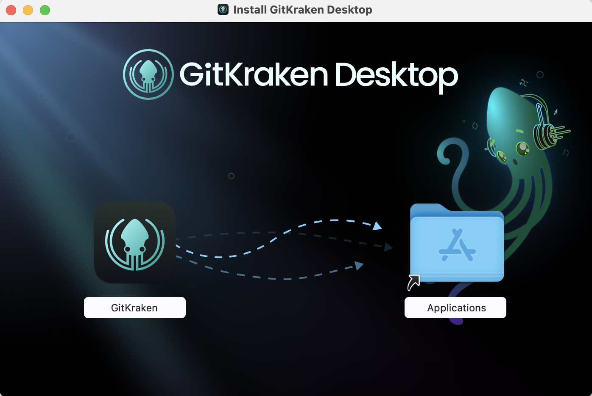

<!-- START doctoc generated TOC please keep comment here to allow auto update -->
<!-- DON'T EDIT THIS SECTION, INSTEAD RE-RUN doctoc TO UPDATE -->

### Table of Contents

- [Windows Subsystem for Linux (WSL)](#windows-subsystem-for-linux-wsl)
  - [Enabling copy and paste in Ubuntu](#enabling-copy-and-paste-in-ubuntu)
- [R and RStudio](#r-and-rstudio)
  - [Installing R for Windows](#installing-r-for-windows)
  - [Installing the RStudio IDE](#installing-the-rstudio-ide)
  - [Installing R for WSL (Ubuntu linux)](#installing-r-for-wsl-ubuntu-linux)
  - [Installing necessary R packages](#installing-necessary-r-packages)
    - [Windows R packages](#windows-r-packages)
    - [WSL (Ubuntu) R packages](#wsl-ubuntu-r-packages)
- [GitKraken](#gitkraken)
- [A suitable text editor](#a-suitable-text-editor)

<!-- END doctoc generated TOC please keep comment here to allow auto update -->


## Windows Subsystem for Linux (WSL)

We will be using a number of UNIX-based tools throughtout this workshop, and many bioinformatics packages are written for that environment.
That used to mean that many such tools were not available for Windows computers, and you needed a separate machine (often a server) to run them.

Thankfully, Windows has introduced the Windows Subsystem for Linux (WSL), which essentially allows you to run a full Linux system from within Windows.
It is a little bit quirky, especially in how it interacts with your "normal" Windows files, but it opens up many tools that were not previously available on Windows.

To install WSL, you will first need to use the Command Prompt.
Type `cmd` in the Windows search box to bring up the Command Prompt, then click the option in the right panel to "Run as administrator".


You will be prompted to allow changes to your system; say yes!

When the Command Prompt window is open, type `wsl --install` into and press Enter.
You should start to see messages about the progress of the installation, which will take several minutes to complete (it may be a while, depending on the speed of your internet connection).


When installation is complete (be patient!), you will see a message asking you to reboot your computer to complete the setup.


Restart your computer, then use the Windows Search Box to launch the **Ubuntu** app.
("Ubuntu" is a one of the more popular versions of Linux, and is the default version that comes with WSL.)
When you launch Ubuntu App, the first thing you will see is that it has more work to do to finish the installation.


When it is ready, you will be prompted to create a username and password for the linux account.
These are separate from your Windows login; be sure to choose a good password and store it somewhere securely.
Note that when you are entering the password (which you will do twice for confirmation), you will see no indication of your typing, just a blank line.


At this point, Ubuntu Linux should be installed and usable, but it may not have all of the latest updates, so we will do one more set of steps.
Most software packages are managed on Ubuntu using a tool called `apt`, so we will use this to check for updates and install them.

In the Ubuntu window, type `sudo apt update` and press Enter.
`sudo` is a command that allows the following commands to be run with elevated privileges, and we use it for commands that may modify the system.
So here we are running `apt update` with elevated privileges, and you will be prompted again to enter your *linux* password to allow this.

You will see messages for a number of files being downloaded, and finally a message that some number of packages can be upgraded.


Now type `sudo apt upgrade` and press Enter to apply all of the available updates.
(If there is a long time between these two `sudo` steps, you may have to enter your password again.)
You will be shown a list of the packages that will be installed (a long list, most likely!) and asked to confirm the installation.
Type `y` (or just Enter) to confirm, then wait for all of the installations to complete.

### Enabling copy and paste in Ubuntu

Copy and paste don't work in the Ubuntu app quite as you might expect them to in the rest of Windows.
There are a number of reasons for this, but part of it is that the "control" key (`Ctrl`) is used for different things in Ubuntu, so there is a risk conflicting instructions if you were to use `Ctrl+C` or `Ctrl+V` as you do in the rest of Windows.
Since some of the commands below are long, though, you will probably want to be able to paste them in!

To enable you to copy and paste, right click on the Ubuntu window title bar and select "Properties".

In the "Edit Options" tab, check the "Use Ctrl+Shit+C/V and Copy/Paste" box, then click the "OK" button.

Now you can use `Ctrl+Shift+C` and `Ctrl+Shift+V` to copy and paste in the Ubuntu window (just don't forget the `Shift`)!


## R and RStudio

This workshop does not require a specific R or RStudio version for this workshop.
If you already have R and RStudio installed for Windows, you can skip that section, but *do not skip the WSL install*!

### Installing R for Windows

First, navigate to the CRAN website in the browser: https://cran.r-project.org/.
Click the link `Download R for Windows`:


On the next page, click the link to install the **base** version of R, then click the `Download R-4.2.0 for Windows` link.

Open the downloaded R installer, `R-4.2.0-win.exe`, and follow the prompts to install R onto your computer.
Note that you will need to give permission to modify your system.
For the remaining prompts, the default settings will be fine.

### Installing the RStudio IDE

We will only be using the RStudio IDE from Windows, so this only needs to be installed once.

First, navigate to the RStudio website's Download page in the browser: https://www.rstudio.com/products/rstudio/download/#download.

### Installing R for WSL (Ubuntu linux)

To install the most recent version of R in the WSL Ubuntu linux environment, we will follow the [instructions from CRAN](https://cran.r-project.org/bin/linux/ubuntu/#install-r), with some modifications.

First we will need to install some linux packages that are required for setting up R, and for some of the R packages we will be using.
Open the Ubuntu app and type (or [paste](#enabling-copy-and-paste-in-ubuntu)) the following command:

 ```sh
 sudo apt install --no-install-recommends software-properties-common dirmngr  libcurl4-openssl-dev libssl-dev libxml2-dev
 ```

You may be prompted to enter your *linux* password, and then you will see a list of packages that will be installed.
Type `y` (or just Enter) to confirm, then wait for all of the installations to complete.

The next step is to add the "signing key" that verifies the authenticity of the R packages from CRAN.
Enter the following command (all on one line):

```sh
wget -qO- https://cloud.r-project.org/bin/linux/ubuntu/marutter_pubkey.asc | sudo tee -a /etc/apt/trusted.gpg.d/cran_ubuntu_key.asc
```

You will see a block of random-looking text printed to the screen, ending with

```sh
---- END PGP PUBLIC KEY BLOCK -----
```

Now we will tell `apt` where to look for the lastest version of R, by entering the following command (all on one line):

```sh
sudo add-apt-repository "deb https://cloud.r-project.org/bin/linux/ubuntu $(lsb_release -cs)-cran40/"
```

Finally, we are ready to actually install R!
Enter

```sh
sudo apt install r-base
```

 into the Ubuntu app, confirm that you want to install the packages, and wait for the installation to complete.

To confirm that the installation was successful, type
```sh
R --version
```

You should see a message that R 4.2.0 (or the most current version of R) is installed.

### Installing necessary R packages

For this workshop, you will need to have the following R packages installed: 

* `tidyverse`
* `rmarkdown`
* `optparse`
* `renv`

If you already have these packages installed, you're good to go!

Otherwise, we will have to do this twice... once for Windows and once for WSL.

#### Windows R packages

Open RStudio (this assumes both R and RStudio have been installed).
You can check if these packages are installed by scrolling through the `Packages` tab in the bottom-right pane of RStudio. 
If you see the package of interest listed, then you know it's installed.
For example, the image below tells us that `optparse` is already installed and no additional action is required to install this package:



If you need to install any of the require packages, use the function `install.packages()` in Console, as follows:

```r
# Install optparse only, for example:
install.packages("optparse")

# Install all necessary packages at once:
install.packages(c("optparse", "renv", "rmarkdown", "tidyverse"))
```

After running this/these command(s), you will see some progress messages pass in Console (maybe in a different color from this image, but that's ok!!).
The following image shows, for example, what these messages look like for a successful installation of `optparse`:



#### WSL (Ubuntu) R packages

To install R packages in the WSL copy of R, we will work again within the Ubuntu app.
Open the Ubuntu app and type `R` at the prompt to open the R console.

At the R console prompt (which will look like this: `>`), type

```r
install.packages(c("optparse", "renv", "rmarkdown", "tidyverse"))
```

 and press Enter.

You will see a message that the default library location is not writeable, and asking "Would you like to use a personal library instead?"
Type `yes` and press Enter, then `yes` again to accept the default library location.

The installation will take some time, and you will see lots of messages scroll by as the source code for each package is "compiled" to work on your computer.
You may see some warnings as the installation proceeds related to `timedatectl`, but these can be safely ignored.

After installation is complete, you can exit the R console by typing `q()` and pressing Enter.
You will be asked whether to save your workspace, and we recommend choosing `n`.

## GitKraken

We will use the GUI (graphical user interface) called `GitKraken` to work with `git` in this workshop. 
This GUI can be installed from https://www.gitkraken.com/, where you can click "Download GitKraken Client Free" (_do not pay!!_):


Then, select the appropriate version for your computer's architecture.


The GitKraken installer will now download.
Double-click the downloaded disk image, and a window will appear where, as the instructions indicate, you should drag the GitKraken icon into the Applications folder icon (all within this window!).




This action completes the installation, and you can now safely delete (eject) the disk image file.


## A suitable text editor

We will use a text editor to write code as part of this workshop, (and more generally, having a good text editor is something you want anyways!).
We recommend [Visual Studio Code ("VS Code")](https://code.visualstudio.com/), but if you already have a text editor you prefer, please feel free to stick with that! 
Some alternatives you may have encountered are [Sublime Text](https://www.sublimetext.com/), [Notepad++](https://notepad-plus-plus.org), and [Atom](https://atom.io/).


To install VS Code, navigate to https://code.visualstudio.com/download in the browser.


