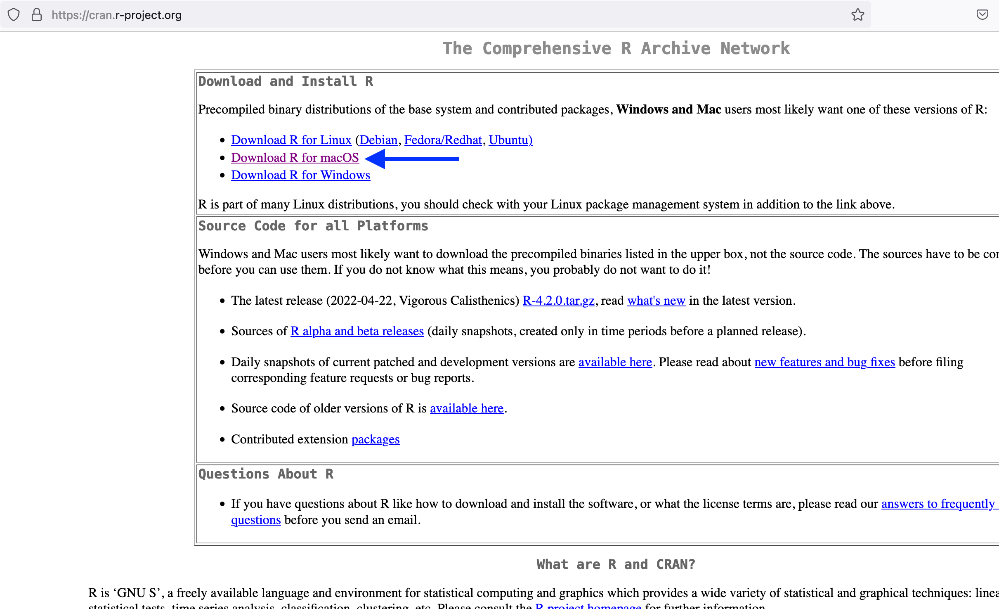

<!-- START doctoc generated TOC please keep comment here to allow auto update -->
<!-- DON'T EDIT THIS SECTION, INSTEAD RE-RUN doctoc TO UPDATE -->

### Table of Contents

- [Windows Subsystem for Linux (WSL)](#windows-subsystem-for-linux-wsl)
- [R and RStudio](#r-and-rstudio)
  - [Installing R for Windows](#installing-r-for-windows)
  - [Installing R for WSL](#installing-r-for-wsl)
  - [Installing the RStudio IDE](#installing-the-rstudio-ide)
  - [Installing necessary R packages](#installing-necessary-r-packages)
    - [Windows](#windows)
    - [WSL](#wsl)
- [GitKraken](#gitkraken)
- [A suitable text editor](#a-suitable-text-editor)

<!-- END doctoc generated TOC please keep comment here to allow auto update -->


## Windows Subsystem for Linux (WSL)

We will be using a number of UNIX-based tools throughtout this workshop, and many bioinformatics packages are written for that environment.
That used to mean that many such tools were not available for Windows computers, and you needed a separate machine (often a server) to run them.

Thankfully, Windows has introduced the Windows Subsystem for Linux (WSL), which essentially allows you to run a full Linux system from within Windows.
It is a little bit quirky, especially in how it interacts with your "normal" Windows files, but it opens up many tools that were not previously available on Windows.

To install WSL, you will first need to open the Command Palette as an administrator.


## R and RStudio

This workshop does not require a specific R or RStudio version for this workshop.
If you already have R and RStudio installed for Windows, you can skip that section, but *do not skip the WSL install*!

### Installing R for Windows

First, navigate to the CRAN website in the browser: https://cran.r-project.org/.
Click the link `Download R for Windows`:




On the next page, click the link to install the **base** version of R, then click the `Download R-4.2.0 for Windows` link.

Open the downloaded R installer, and follow instructions to install R onto your computer.
Make sure to agree to the license in the setup menu and give your computer's password when prompted!

### Installing R for WSL

### Installing the RStudio IDE

We will only be using the RStudio IDE from Windows, so this only needs to be installed once.

First, navigate to the RStudio website's Download page in the browser: https://www.rstudio.com/products/rstudio/download/#download.


### Installing necessary R packages

For this workshop, you will need to have the following R packages installed: 

* `tidyverse`
* `rmarkdown`
* `optparse`
* `renv`

If you already have these packages installed, you're good to go!

Otherwise, we will have to do this twice... once for Windows and once for WSL.

#### Windows

Open RStudio (this assumes both R and RStudio have been installed).
You can check if these packages are installed by scrolling through the `Packages` tab in the bottom-right pane of RStudio. 
If you see the package of interest listed, then you know it's installed.
For example, the image below tells us that `optparse` is already installed and no additional action is required to install this package:


If you need to install any of the require packages, use the function `install.packages()` in Console, as follows:

```sh
# Install optparse only, for example:
install.packages("optparse")

# Install all necessary packages at once:
install.packages(c("optparse", "renv", "rmarkdown", "tidyverse"))
```

After running this/these command(s), you will see some progress messages pass in Console (maybe in a different color from this image, but that's ok!!).
The following image shows, for example, what these messages look like for a successful installation of `optparse`:


#### WSL

To install packages in the WSL copy of R, we will work from

## GitKraken

We will use the GUI (graphical user interface) called `GitKraken` to work with `git` in this workshop. 
This GUI can be installed from https://www.gitkraken.com/, where you can click "Download GitKraken Client Free" (_do not pay!!_):


Then, select the appropriate version for your computer's architecture.


The GitKraken installer will now download.
Double-click the downloaded disk image, and a window will appear where, as the instructions indicate, you should drag the GitKraken icon into the Applications folder icon (all within this window!).


This action completes the installation, and you can now safely delete (eject) the disk image file.


## A suitable text editor

We will use a text editor to write code as part of this workshop, (and more generally, having a good text editor is something you want anyways!).
We recommend [Visual Studio Code ("VS Code")](https://code.visualstudio.com/), but if you already have a text editor you prefer, please feel free to stick with that! 
Some alternatives you may have encountered are [Sublime Text](https://www.sublimetext.com/), [Notepad++](https://notepad-plus-plus.org), and [Atom](https://atom.io/).


To install VS Code, navigate to https://code.visualstudio.com/download in the browser.


