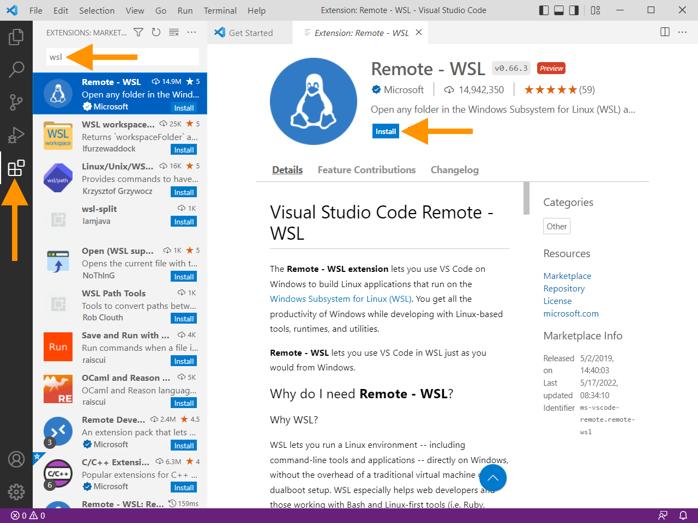

**Table of contents**

* TOC goes here
{:toc}


> Please be aware this setup process may take 1-2 hours to complete!

## Windows Subsystem for Linux (WSL)

We will be using a number of UNIX-based tools throughout this workshop, and many bioinformatics packages are written for that environment.
That used to mean that many such tools were not available for Windows computers, and you needed a separate machine (often a server) to run them.

Thankfully, Windows has introduced the Windows Subsystem for Linux (WSL), which essentially allows you to run a full Linux system from within Windows.
It is a little bit quirky, especially in how it interacts with your "normal" Windows files, but it opens up many tools that were not previously available on Windows.

To install WSL, you will first need to use the Command Prompt.
Type `cmd` in the Windows search box to bring up the Command Prompt, then click the option in the right panel to "Run as administrator".
(Note that all of the screenshots below were taken with Windows 10; if you have Windows 11, you may see some slight differences, but the steps should be the same.)


You will be prompted to allow changes to your system; say yes!

When the Command Prompt window is open, type `wsl --install -d ubuntu` and press Enter to install WSL and the Ubuntu version of Linux.
("Ubuntu" is one of the more popular versions of Linux, and the default version that comes with WSL.)
You should start to see messages about the progress of the installation, which will take several minutes to complete (it may be a while, depending on the speed of your internet connection).


If WSL and Ubuntu are already installed, you may see a short message, followed by the Ubuntu app opening.

When installation is complete (be patient!), you will see a message asking you to reboot your computer to complete the setup.


Restart your computer, then use the Windows Start menu to launch the **Ubuntu** app.

When you launch the Ubuntu App, the first thing you may see is that it has more work to do to finish the installation.


When the Linux installation is ready, you will be prompted to create a username and password for the Linux account.
These are separate from your Windows login; be sure to choose a good password and store it somewhere securely.
Note that when you are entering the password (which you will do twice for confirmation), you will see no indication of your typing, just a blank line.
_Your password is still being entered even though you don't see any symbols!_
After you type your password (each time), hit Enter to proceed to the next step.


At this point, Ubuntu Linux should be installed and usable, but it may not have all of the latest updates, so we will do one more set of steps.
Most software packages are managed on Ubuntu using a tool called `apt`, so we will use this to check for updates and install them.

In the Ubuntu window, which is a Linux "terminal", type `sudo apt update` and press Enter.
`sudo` is a command that allows the following commands to be run with elevated privileges, and we use it for commands that may modify the system.
So here we are running `apt update` with elevated privileges, and you will be prompted again to enter your *Linux* password to allow this.
(Here again, you won't see your typing, but be assured that the computer is seeing what you type!)

You will see messages for a number of files being downloaded, and finally a message that some number of packages can be upgraded.


Now type `sudo apt upgrade` and press Enter to apply all of the available updates.
(If there is a long time between these two `sudo` steps, you may have to enter your password again.)
You will be shown a list of the packages that will be installed (a long list, most likely!) and asked to confirm the installation.
Type `y` (or just Enter) to confirm, then wait for all of the installations to complete.

### Optional: Enabling copy and paste in Ubuntu on Windows 10

On Windows 10, copy and paste may not work in the Ubuntu app quite as you might expect them to in the rest of Windows.
There are a number of reasons for this, but part of it is that the "control" key (`Ctrl`) is used for different things in Ubuntu, so there is a risk conflicting instructions if you were to use `Ctrl+C` or `Ctrl+V` as you might in the rest of Windows.
Since some of the later commands are long, you will probably want to be able to paste them in!

You can paste into the Ubuntu terminal by right clicking in the Ubuntu window.
You will not see a menu like you might normally expect; whatever you last copied will just paste in immediately.

To enable copy and paste with keyboard shortcuts in the Linux environment, right click on the Ubuntu window title bar and select "Properties".


In the "Edit Options" tab, check the "Use `Ctrl`+Shift+C/V and Copy/Paste" box, then click the "OK" button.


Now you can use `Ctrl+Shift+C` and `Ctrl+Shift+V` to copy and paste in the Ubuntu window (just don't forget the `Shift`)!

On Windows 11, it seems that the "Properties" menu is gone, but copy and paste work more like you expect.
Right clicking still pastes immediately (with no popup menu) though!

## R and RStudio

This workshop does not require a specific R or RStudio version.
To be able to run R both interactively via RStudio _and_ from the Ubuntu command line, you will need to install R and certain R packages on both the Linux and Windows sides of your computer, as described in the remaining instructions.
However, you will _only_ need to install RStudio on the Windows side.
If you already have R and RStudio installed for Windows, you can skip that section, but *do not skip the [WSL installation of R and R packages](#wsl-ubuntu-linux-installation-of-r-and-r-packages) section*.

For this workshop, you will also need to have the following R packages installed:

* `here`
* `optparse`
* `renv`
* `rmarkdown`
* `tidyverse`


If you already have these packages installed, you're good to go!

Otherwise, we may have to install them twice... [once for Windows](#r-packages-for-windows) and [once for WSL](#r-packages-for-wsl).

### Windows Installation of R, RStudio, and R Packages

#### R for Windows

First, navigate to the CRAN website in the browser: <https://cran.r-project.org/>.
Click the link `Download R for Windows`:


On the next page, click the link to choose the **base** version of R, then click the `Download R-4.3.1 for Windows` link (or whatever the current version is).

Open the downloaded R installer, `R-4.3.1-win.exe`, and follow the prompts to install R onto your computer.
Note that you will need to give permission to modify your system.
For the remaining prompts, the default settings will be fine.

#### Optional: Install RTools

Most packages for R are available in a "binary" format, which means that they have already been "compiled" for use on Windows.
However, some packages are only available as source code, and may require compilation locally, for which you will need to install RTools.
(R will also aggressively warn about missing RTools every time you install a package, so you may want to install it just to quiet the warnings.)

For this installation, go to https://cran.r-project.org/bin/windows/Rtools.
Select link the version of RTools appropriate for your version of R; if you have just installed R above, this will be the "RTools 4.3" link.
(Why is the "T" capitalized here and nowhere else? No idea.)
Find the link for the installer (this page changes somewhat frequently, so you may have to search a bit) and click to download.

Open the downloaded `.exe` file and follow the prompts to allow changes and install RTools, accepting the default settings.

#### RStudio for Windows

First, navigate to the RStudio website's Download page in the browser: <https://posit.co/download/rstudio-desktop/#download>.
Click the button to download RStudio for Windows.


The downloaded installer will have a name like `RStudio-2022.02.2-win.exe` (the exact name may vary depending on the current version).
Open this file and follow the prompts to install RStudio onto your computer.
You may need to give permission to modify your system.

#### R packages for Windows

Open RStudio (this assumes both R and RStudio have been installed).
You can check if the required packages (`tidyverse`, `rmarkdown`, `optparse`, and `renv`) are installed by scrolling through the `Packages` tab in the bottom-right pane of RStudio.
If you see the package of interest listed, then you know it's installed.
For example, the image below tells us that `optparse` is already installed and no additional action is required to install this package:


If you need to install any of the required packages, use the function `install.packages()` in Console, as follows:

```r
# Install optparse only, for example:
install.packages("optparse")

# Install all necessary packages at once:
install.packages(c("here", "optparse", "renv", "rmarkdown", "tidyverse"))
```

After running this/these command(s), you will see some progress messages pass in Console (maybe in a different color from this image, but that's ok!!).
The following image shows, for example, what these messages look like for a successful installation of `optparse`:


You may see a warning that "RTools is required to build R packages", but this can usually be safely ignored unless you see a later error.
If you want to quiet the warning, you can go back to the [Install RTools](#optional-install-rtools) section and follow the instructions there.

### WSL (Ubuntu Linux) Installation of R and R Packages

#### R for WSL
To install the most recent version of R in the WSL Ubuntu Linux environment, we will follow the [instructions from CRAN](https://cran.r-project.org/bin/linux/ubuntu/#install-r), with some modifications.

First we will need to install some Linux packages that are required for setting up R and for some of the R packages we will be using.
Open the Ubuntu app and type (or [paste](#optional-enabling-copy-and-paste-in-ubuntu)) the following command.
(This is a long command! Make sure to get the whole line!):

 ```
 sudo apt install --no-install-recommends software-properties-common dirmngr libcurl4-openssl-dev libssl-dev libxml2-dev libfontconfig-dev libharfbuzz-dev libfribidi-dev libtiff-dev
 ```

You may be prompted to enter your *Linux* password, and then you will see a list of packages that will be installed.
Type `y` (or just Enter) to confirm, then wait for all of the installations to complete.

The next step is to add the "signing key" that verifies the authenticity of the R packages from CRAN.
Enter the following command (all on one line):

```
wget -qO- https://cloud.r-project.org/bin/linux/ubuntu/marutter_pubkey.asc | sudo tee -a /etc/apt/trusted.gpg.d/cran_ubuntu_key.asc
```

You will see a block of random-looking text printed to the screen, ending with

```
---- END PGP PUBLIC KEY BLOCK -----
```

Now we will tell `apt` where to look for the latest version of R, by entering the following command (all on one line):

```
sudo add-apt-repository "deb https://cloud.r-project.org/bin/linux/ubuntu $(lsb_release -cs)-cran40/"
```


Finally, we are ready to actually install R!
Enter the following:

```sh
sudo apt install r-base
```

 into the Ubuntu app, confirm that you want to install the packages, and wait for the installation to complete.

To confirm that the installation was successful, type
```sh
R --version
```

You should see a message that R 4.2.0 (or the most current version of R) is installed.


#### R packages for WSL

To install R packages in the WSL copy of R, we will work again within the Ubuntu app.
Open the Ubuntu app and type `R` at the prompt to launch the R console.

At the R console prompt (which will look like this: `>`), type

```r
install.packages(c("here", "optparse", "renv", "rmarkdown", "tidyverse"))
```
and press Enter.

You may see a message that the default library location is not writeable, and asking "Would you like to use a personal library instead?"
Type `yes` and press Enter, then `yes` again to accept the default library location.


The installation will take some time, and you will see lots of messages scroll by as the source code for each package is "compiled" to work on your computer.
You may see some warnings as the installation proceeds related to `timedatectl`, but these can be safely ignored.

After installation is complete, you can exit the R console by typing `q()` and pressing Enter.
You will be asked whether to save your workspace, and we recommend choosing `n`.

## GitKraken

We will use the GUI (graphical user interface) called `GitKraken` to work with `git` in this workshop.


GitKraken can be installed from <https://www.gitkraken.com>, where you can click "Download GitKraken Client Free" (_do not pay!!_):


The GitKraken installer will now download as `GitKrakenSetup.exe`.
Open this file and follow the prompts to install GitKraken onto your computer.
At the completion of installation, GitKraken will launch and ask you to login.
If you have already set up a GitHub account, you can use that to login, or simply close the window come back to finishing the setup later.


For more information on setting up a GitHub account and the initial GitKraken setup, see our [GitHub Setup instructions](github_gitkraken_setup_instructions.md).

## A suitable text editor

We will use a text editor to write code as part of this workshop, (and more generally, having a good text editor is something you want anyways!).
We recommend [Visual Studio Code ("VS Code")](https://code.visualstudio.com/), but if you already have a text editor you prefer, please feel free to stick with that!
Some alternatives you may have encountered are [Sublime Text](https://www.sublimetext.com/) and [Notepad++](https://notepad-plus-plus.org).
### Installing Visual Studio Code

To install VS Code, navigate to <https://code.visualstudio.com/download> in the browser.
Click the button labeled "Download for Windows".


The downloaded installer will have a name like `VSCodeUserSetup-x64-1.67.2.exe` (the exact name may vary depending on the current version).
Open this installer and follow the instructions for installing VS Code, agreeing to any required terms and providing any requested permissions.
When you reach the page titled "Select Additional Tasks", we recommend checking the all of the boxes in the "Other" section (some may be pre-checked).


After installation is complete, we can install an extension to enable easier interaction between VS Code and WSL.
Open Visual Studio Code, and click the icon in the left side panel that looks like 4 squares (with one separated) to open the "Extensions" panel in the left panel.
In the search box that appears at the top of the left panel, type "WSL".
Select the "WSL" item from the list (with the penguin icon) and click the "Install" button.
(In prior versions, this extension was called "Remotes - WSL", so the screenshot below is not quite accurate)



VS Code is a very powerful program with a ton of ways to customize it.
All of the flexibility can be a tad overwhelming!
There are hundreds of options that affect the program's behavior and hundreds of available extensions which expand its functionality, or just change the way it looks.
We encourage you to explore a bit on your own; we'll be happy to share our favorite tricks during the workshop!
VS Code provides some useful [introductory videos](https://code.visualstudio.com/docs/getstarted/introvideos) as you begin your journey!
