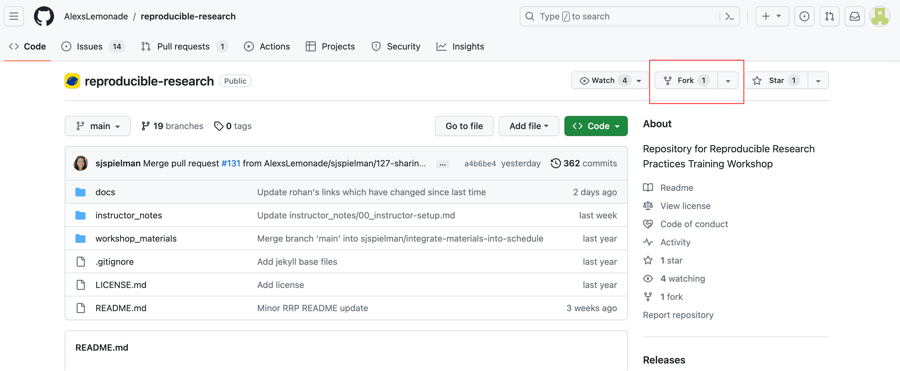
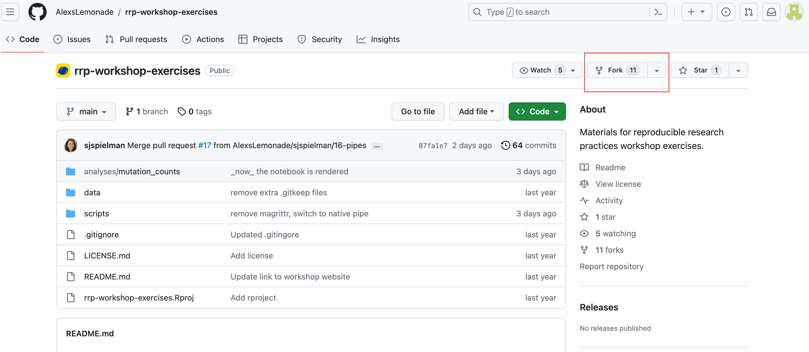

# Using tools and materials

**You must have GitHub, GitKraken, R, RStudio, and a suitable text editor installed on the machine you will be instructing with.**
It is necessary to install most of the tools and software before proceeding with the instructions below.
The [`setup_instructions` folder](https://github.com/AlexsLemonade/reproducible-research/tree/main/docs/setup_instructions) in the `reproducible-research` repository contains helpful information for installing these tools. 

## Training materials

**1.) The [`reproducible-research` repository](https://github.com/AlexsLemonade/reproducible-research) holds materials such as lecture slides, cheatsheets, and instructor notes that provide guidance for teaching certain activities in this course.**
Fork the repository, to create your own copy of the materials.

* Navigate to the [`reproducible-research` repository](https://github.com/AlexsLemonade/reproducible-research) and click `Fork`.

* Make sure you are the owner of the new repository and click `Create Fork`.

**2.) You will also be using another repository, called [`rrp-workshop-exercises`](https://github.com/AlexsLemonade/rrp-workshop-exercises).**
This separate repository holds exercises, data, and scripts used during the interactive portion of the course.
(During the workshop, participants will also fork and clone `rrp-workshop-exercises` to use it as an example repository!)

Although you will be walking participants through forking this repository in real-time during the course, you should certainly create your own copy and get familiar with the exercises and materials ahead of time!

* Navigate to the [`rrp-workshop-exercises` repository](https://github.com/AlexsLemonade/rrp-workshop-exercises) and click `Fork`.

* Make sure you are the owner of the new repository and click `Create Fork`.

After forking each of the repositories, you will have access to all materials and can make any modifications to your own copies. 
You can interact with the materials on your GitHub account, but we recommend that you also clone your new repositories to your own computer using the command line or a GUI! 

* **Need help with this?** [Check out the instructions](https://docs.google.com/presentation/d/1eiGZA4PYBKJx5HDCo3UDOAB7q415gg96TehxilCHwlA/edit#slide=id.p) provided in the slides for the `Introduction to Git; Forking and cloning a repository` module of the workshop!

## Creating a course website