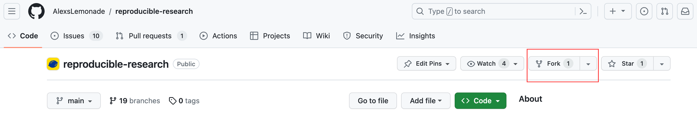
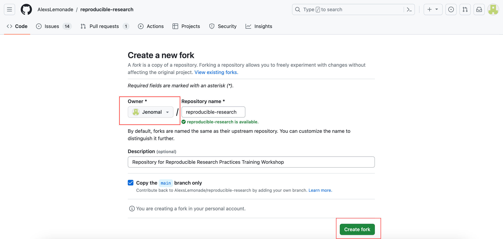
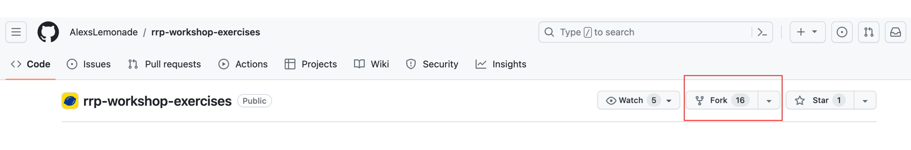
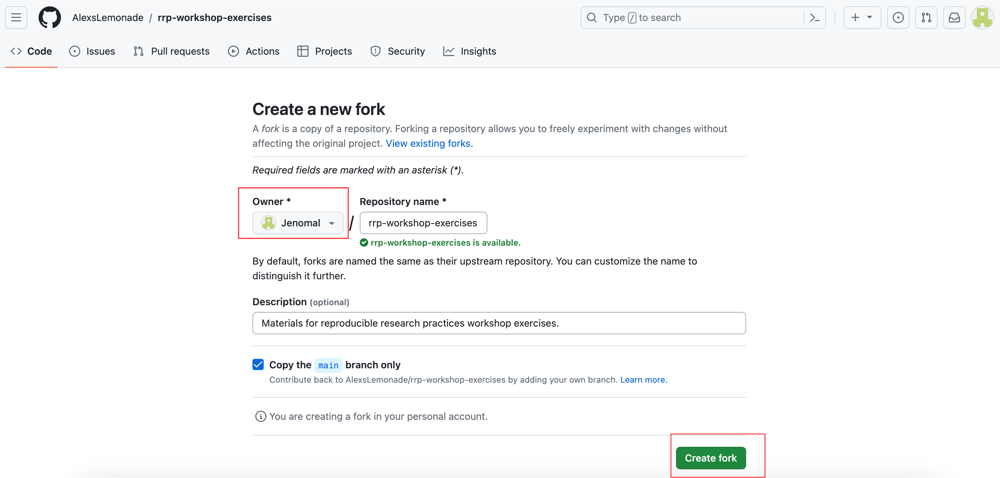

# Using tools and materials

**You must have GitHub, GitKraken, R, RStudio, and a suitable text editor installed on the machine you will be instructing with.**
You should do this before proceeding with the instructions below.
The [`setup_instructions` folder](https://github.com/AlexsLemonade/reproducible-research/tree/main/docs/setup_instructions) in the `reproducible-research` repository contains helpful information for installing these tools. 

## Training materials

**1.) The [`reproducible-research` repository](https://github.com/AlexsLemonade/reproducible-research) holds materials such as lecture slides, cheatsheets, and instructor notes.**
Fork the repository, to create your own copy of the materials.

* Navigate to the [`reproducible-research` repository](https://github.com/AlexsLemonade/reproducible-research) and click `Fork`.

 
* Make sure you are the owner of the new repository and click `Create Fork`.

* Now you will have your own copy of the repository and can make any modifications to the materials. 
* The`docs` directory contains content for the course website.
	* Be sure to update the `workshop-schedule.md` and `participant_information.md` files for your own workshop!
* The `instructor_notes` directory contains notes for live demonstration instruction. Refer to these notes for helpful guidance on teaching certain activities in this course.
* The `workshop_materials` directory contains additional workshop materials such as cheatsheets and links to the lecture slides.

**2.) You will also be using another repository, called [`rrp-workshop-exercises`](https://github.com/AlexsLemonade/rrp-workshop-exercises).**
This separate repository holds exercises, data, and scripts used during the interactive portion of the course.
(During the workshop, participants will also fork and clone `rrp-workshop-exercises` to use as an example repository!)

Although you will be walking participants through forking this repository in real-time during the course, you should certainly create your own copy and get familiar with the exercises and materials ahead of time. 
If you will be leading live demonstrations from the same GitHub account where you create this copy, please remember to delete your fork before the workshop.

* Navigate to the [`rrp-workshop-exercises` repository](https://github.com/AlexsLemonade/rrp-workshop-exercises) and click `Fork`.

* Make sure you are the owner of the new repository and click `Create Fork`.

* **Need help with this?** [Check out the instructions](https://docs.google.com/presentation/d/1eiGZA4PYBKJx5HDCo3UDOAB7q415gg96TehxilCHwlA/edit#slide=id.p) provided in the slides for the `Introduction to Git; Forking and cloning a repository` module of the workshop!