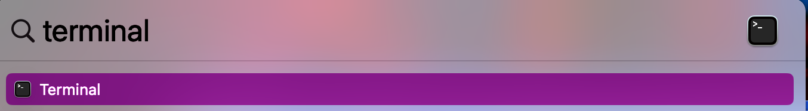
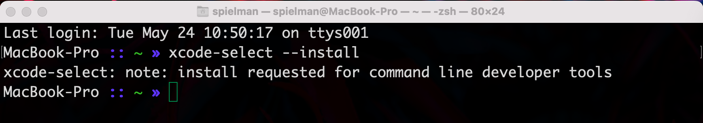
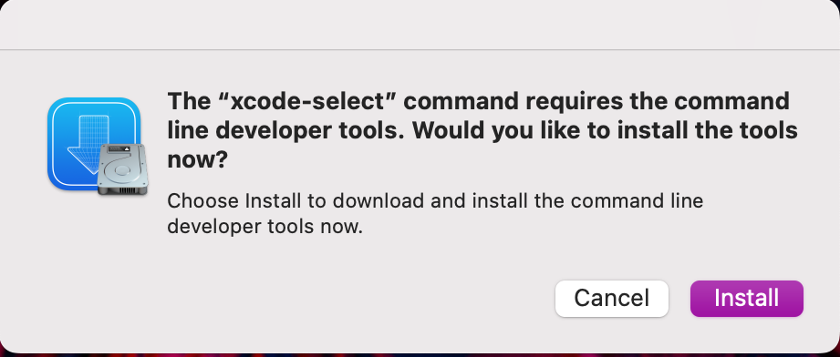
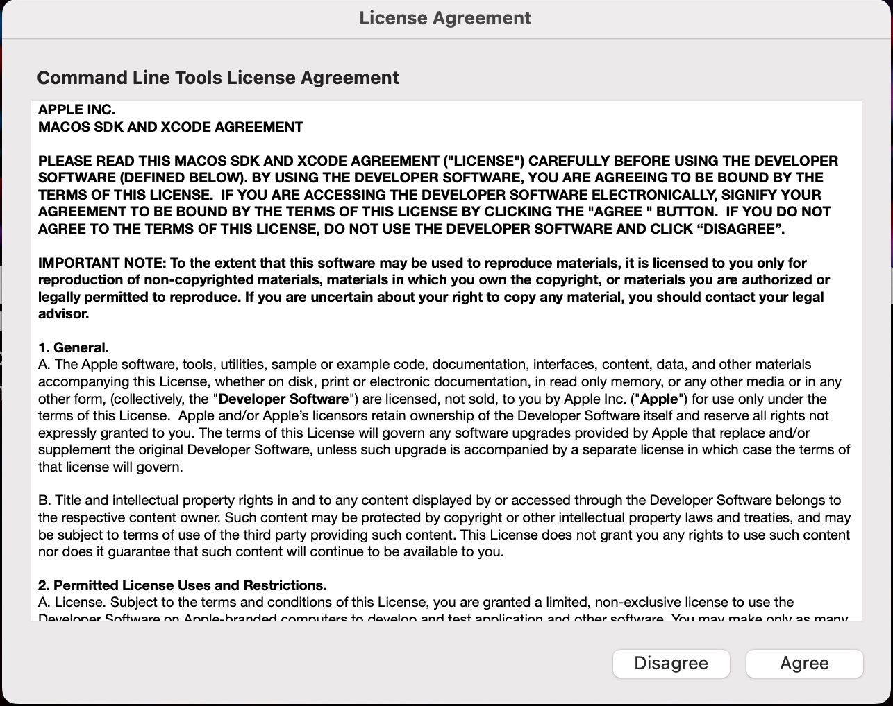
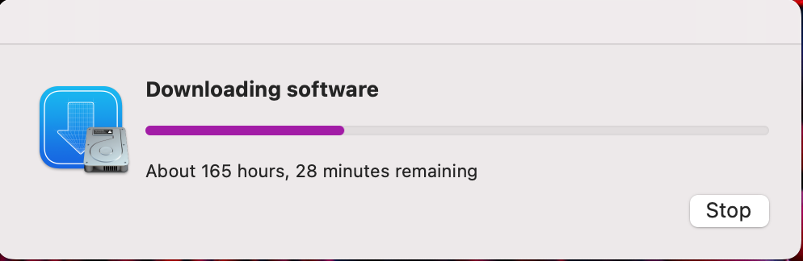
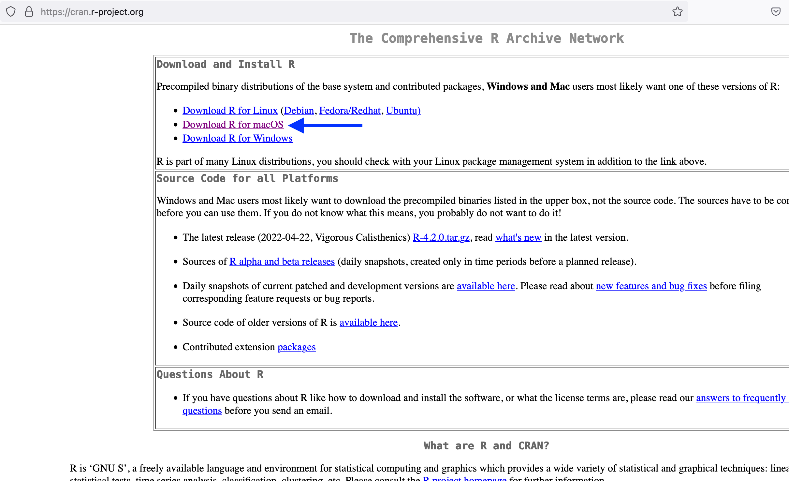
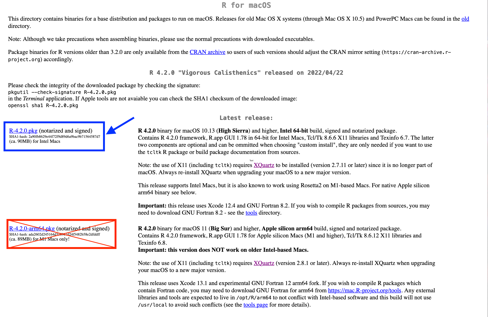
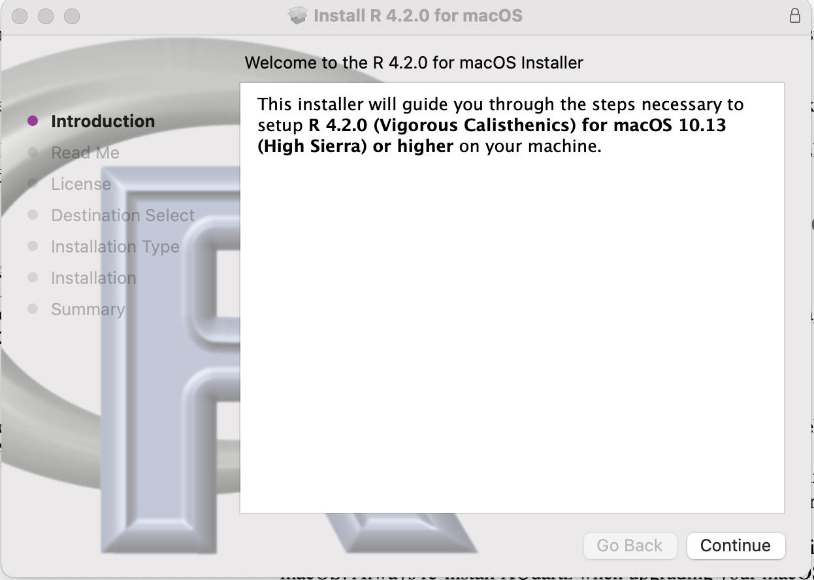
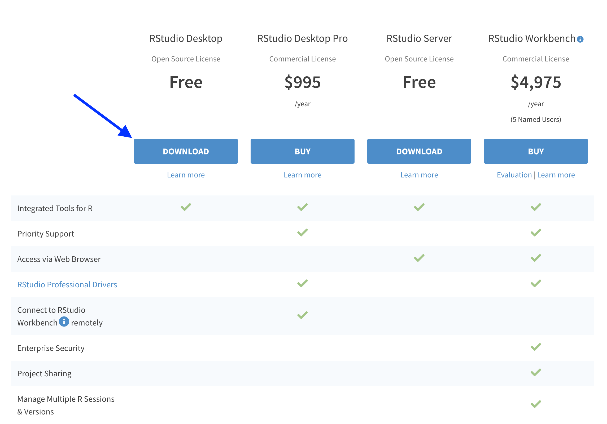
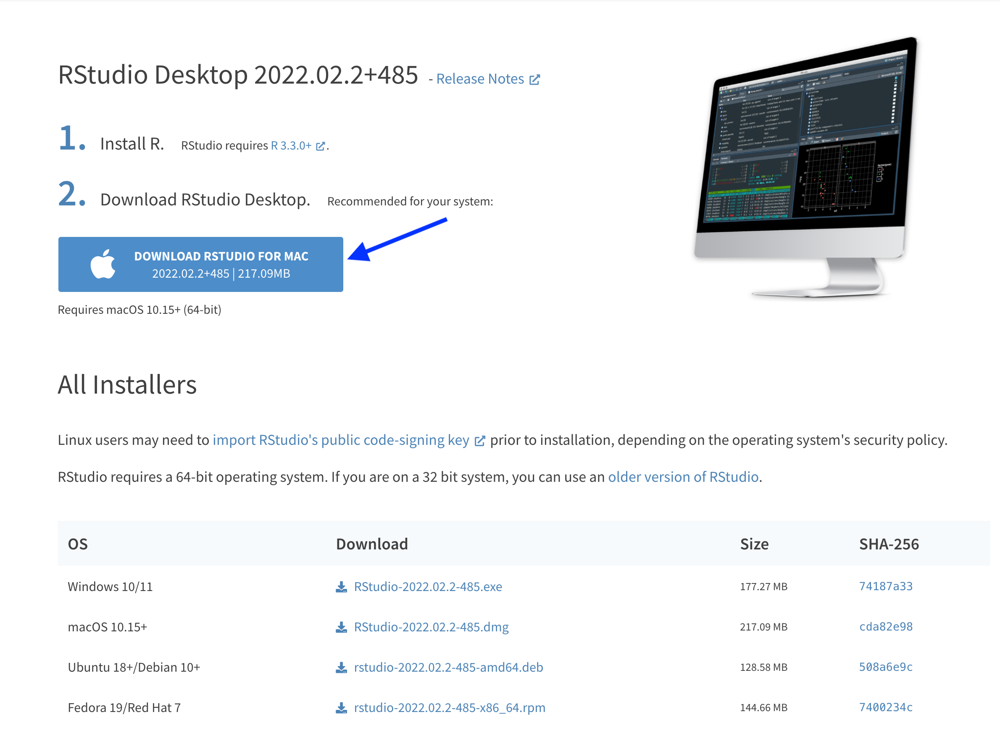

<!-- START doctoc generated TOC please keep comment here to allow auto update -->
<!-- DON'T EDIT THIS SECTION, INSTEAD RE-RUN doctoc TO UPDATE -->

### Table of Contents

- [Apple Command Line Tools](#apple-command-line-tools)
- [R and RStudio](#r-and-rstudio)
  - [Installing R](#installing-r)
  - [Installing the RStudio IDE](#installing-the-rstudio-ide)
  - [Installing necessary R packages](#installing-necessary-r-packages)
- [GitKraken](#gitkraken)
- [A suitable text editor](#a-suitable-text-editor)

<!-- END doctoc generated TOC please keep comment here to allow auto update -->


## Apple Command Line Tools

Apple provides a suite of "command line tools" to facilitate computer programming, and these tools include `git` which we will use for this workshop.
To install the command line tools, open the **Terminal** application by searching for "Terminal" in Spotlight:




> A note on using Terminal: Terminal will likely (and often when you first start using it!) prompt you with messages like, "Terminal would like to access files on Desktop." 
> If/when you see this message, _always agree_!
> Agreeing allows your Terminal to access your computer's file system.

When Terminal is open, type `xcode-select --install` into the Terminal and press Enter, which will reveal a message as follows:




Shortly after, a separate window will pop up prompting you to install command line tools, where you should click `Install`:



A license agreement will then appear, which you should `Agree` to in order to continue with the installation:



Finally, command line tools will install, and you can follow its progress in this window that will appear.
Importantly, this screen tends to first appear with outrageous installation times, like 165 hours (!) below.
**Don't panic!** 
These outrageous times will drop quickly, and the whole process will _really_ take about 10-20 minutes.




## R and RStudio 

This workshop does not require a specific R or RStudio version for this workshop.
If you already have R and RStudio installed, you can skip this section!

### Installing R

First, navigate to the CRAN website in the browser: https://cran.r-project.org/. 
Click the link `Download R for macOS`:




On the next page, click the link to install the **Intel 64-bit** of R, `R-4.2.0.pkg` (blue box in the image below).
This Intel version will still work on M1 computers.
We do **NOT** recommend installing the Apple silicon arm64 (crossed out in the image below) build because it tends to conflict with some Bioconductor packages which you may want to use in your own research.





Open the downloaded R installer, and follow instructions to install R onto your computer.
Make sure to agree to the license in the setup menu and give your computer's password when prompted!



### Installing the RStudio IDE


First, navigate to the RStudio Download page website in the browser: https://www.rstudio.com/products/rstudio/download/. 
Click the link to Download the **Free** version of RStudio Desktop.




Next, click the large link to Download RStudio for Mac:



Open the downloaded RStudio installer, and follow instructions to install it onto your computer.
Note that if you're using an Apple Silicon (M1) chip, you may be prompted to install something called `Rosetta 2` in order to use RStudio. 
`Rosetta 2` is a software made by Apple to support the Intel to M1 transition, and it is currently needed to run RStudio on M1 chips.
If prompted to install `Rosetta 2`, agree to the prompt and follow instructions accordingly.


### Installing necessary R packages

For this workshop, you will need to have the following R packages installed: 
+ `tidyverse`
+ `rmarkdown`
+ `optparse`
+ `renv`

If you already have these packages installed, you're good to go!


Otherwise, open RStudio (this assumes both R and RStudio have been installed).
You can check if these packages are installed by scrolling through the `Packages` tab in the bottom-right pane of RStudio. 
If you see the package of interest listed, then you know it's installed.
For example, the image below tells us that `optparse` is already installed and no additional action is required to install this package:


If you need to install any of the require packages, use the function `install.packages()` in Console, as follows:

```sh
# Install optparse only:
install.packages("optparse")

# Install rmarkdown only:
install.packages("rmarkdown")

# Install tidyverse only:
install.packages("tidyverse")

# Install renv only:
install.packages("renv")

# Or, you can install several simultaneously
# For example, this installs optparse and renv :
install.packages(c("optparse", "renv"))
```

After running this/these command(s), you will see some progress messages pass in Console (maybe in a different color from this image, but that's ok!!).
The following image shows, for example, what these messages look like for a successful installation of `optparse`:


> Note: While installing packages, you may be prompted to install Command Line Tools if you didn't install it already.
> If you see this message, agree to it and follow all installation steps for Command Line Tools.


## GitKraken

We will use the GUI (graphical user interface) called `GitKraken` to work with `git` in this workshop. 
This GUI can be installed from https://www.gitkraken.com/, where you can click "Download GitKraken Client Free" (_do not pay!!_):


Then, select the appropriate version for your computer's architecture.


The GitKraken installer will now download, and when completed, open it and follow all installation instructions.


## A suitable text editor

macOS comes with a "text editor" program called "TextEdit." 
**In spite of its compelling name, this is _NOT_ a recommend text editor for writing computer code!**
**Please do not use TextEdit!**

Instead, we recommend you obtain one of the following (_free versions!_) of these more robust text editors:

+ [Visual Studio Code](https://code.visualstudio.com/)
+ [Sublime Text](https://www.sublimetext.com/)
+ [BBEdit](https://www.barebones.com/products/bbedit/)


