<!-- START doctoc generated TOC please keep comment here to allow auto update -->
<!-- DON'T EDIT THIS SECTION, INSTEAD RE-RUN doctoc TO UPDATE -->
### Table of Contents

- [Creating a GitHub account](#creating-a-github-account)
- [Enabling Two-Factor Authentication (2FA) on GitHub](#enabling-two-factor-authentication-2fa-on-github)
  - [2FA with an Authenticator App](#2fa-with-an-authenticator-app)
  - [2FA with SMS](#2fa-with-sms)
- [Setting up GitKraken](#setting-up-gitkraken)

<!-- END doctoc generated TOC please keep comment here to allow auto update -->

## Creating a GitHub account

Navigate in the browser to https://github.com, and click "Sign Up" in the top-right corner.

GitHub will then lead you through a series of (outerspace-themed!) setup prompts, beginning with your email, password, and username, as shown here for example:

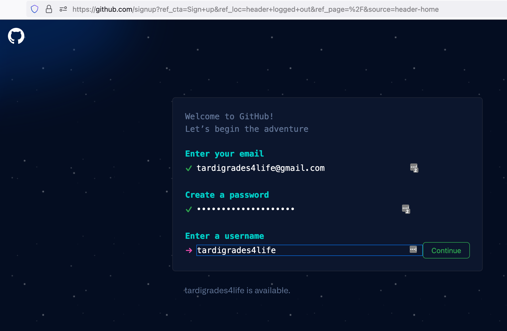

After you have filled the required information, GitHub will send the email you provided a one-time code for verification, which you can enter on the next screen.

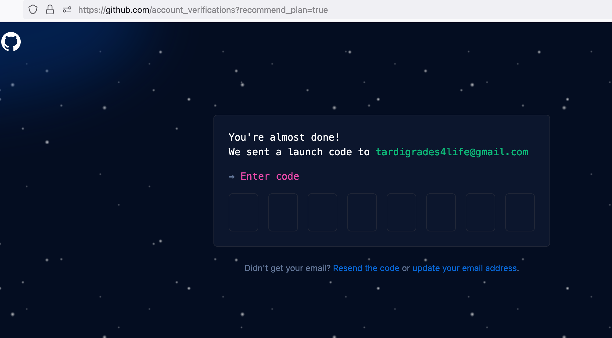

Next, GitHub will prompt you to fill out certain **Optional** personalization settings. 
You can skip this if you prefer (yellow arrow below), or you can follow the prompts accordingly.

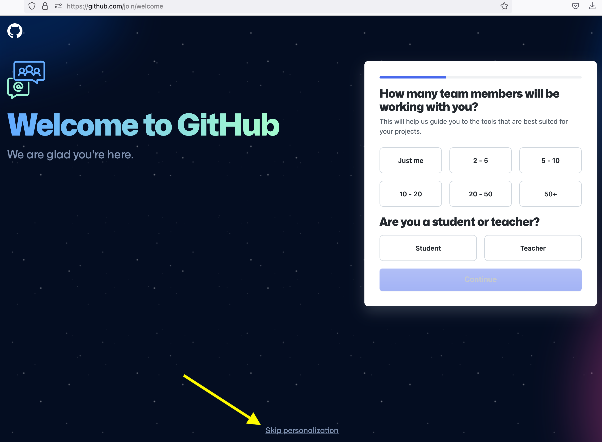

Finally, you'll zoom through outerspace and arrive at your new GitHub home account page:

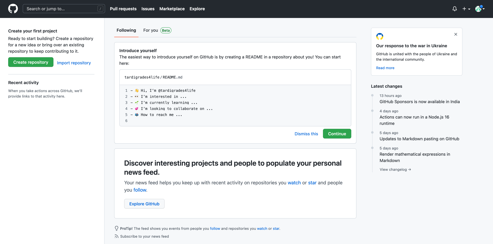

## Enabling Two-Factor Authentication (2FA) on GitHub

> Please do NOT skip this step! It is a necessary security setting.

From the top-right corner Account dropdown icon (looks like weirdly arranged squares), click on "Settings."

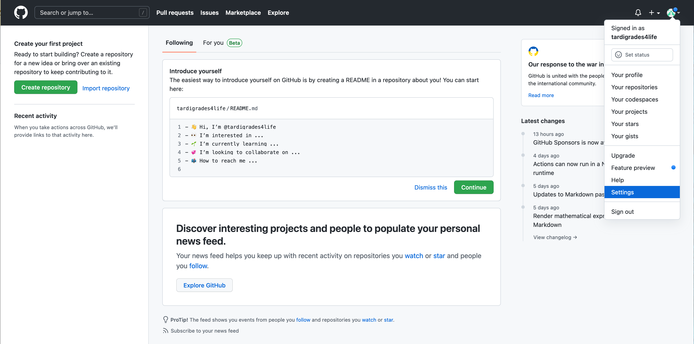

From the left-hand menu, select "Password and Authentication."
Note, you can also take this moment to fill in your GitHub Public Profile, including your public-facing name, picture, email, bio, any anything else you like. 

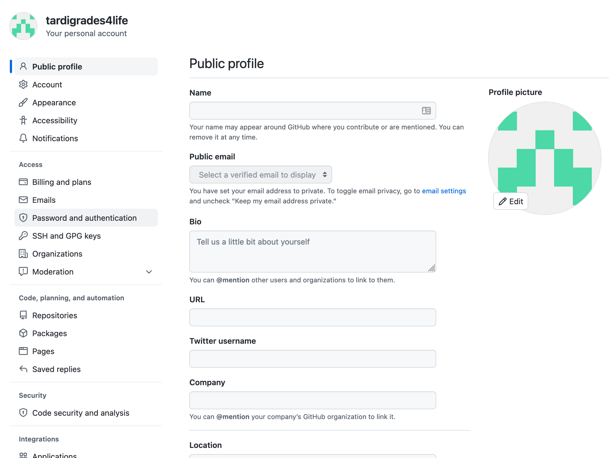

Click the large green button to "Enable two-factor authentication":

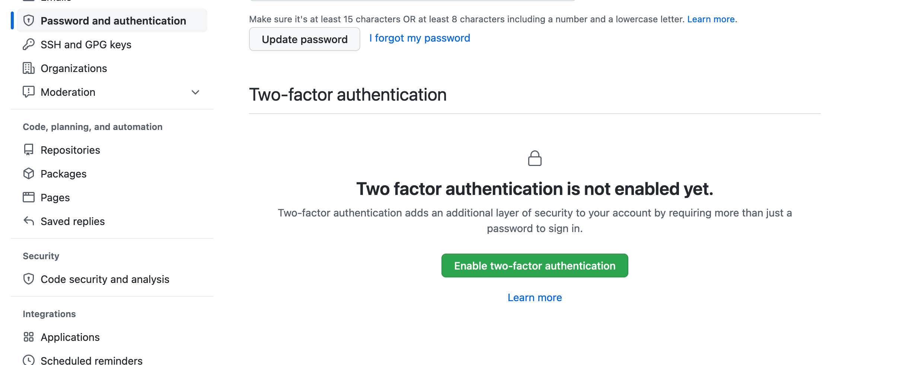

You will then see several options for what _type_ of 2FA you can set up.
_For the best security, we **strongly** recommend that you click "Set up using an app."_
This action requires that you install a separate app on your smart phone, such as the options 1Password, Authy, LastPass Authenticator, or Microsoft Authenticator. 
An additional option you can use that is not directly listed is Google Authenticator.
Click "Continue" after you have selected your option.

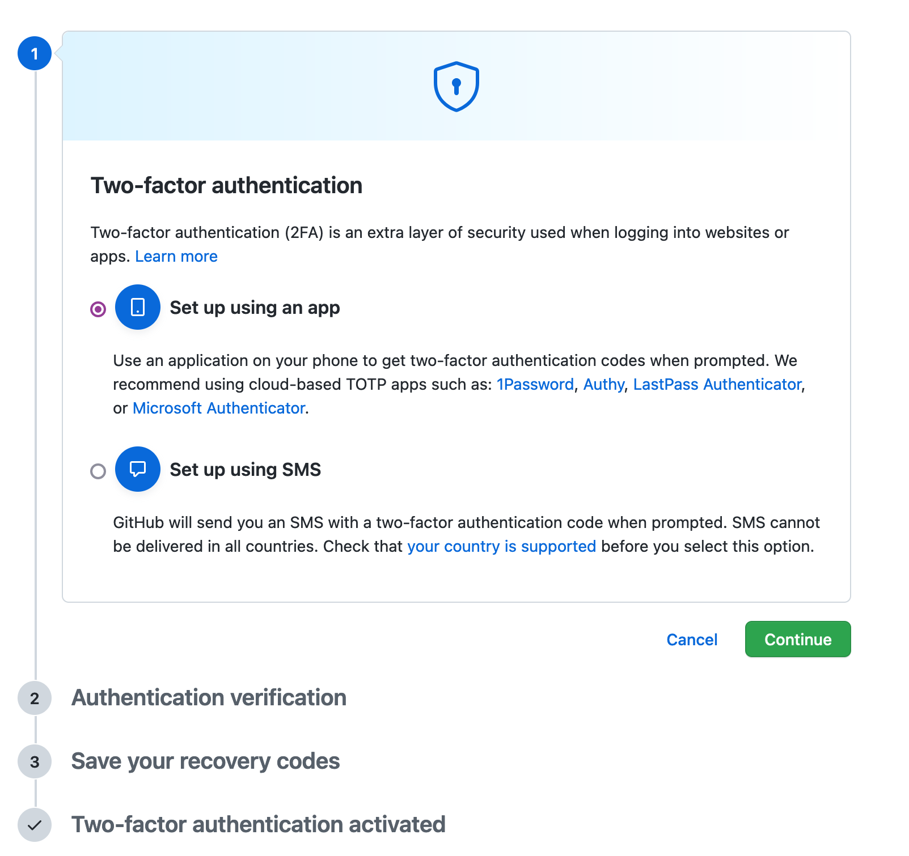

### 2FA with an Authenticator App

Take a moment to either download a preferred 2FA app on your smartphone, or open a 2FA app if you already have one on your smartphone.

After clicking "Continue,", you will see a QR code to scan _into your smartphone app_ (or click "enter this text code" if you prefer not to use the QR code with camera).

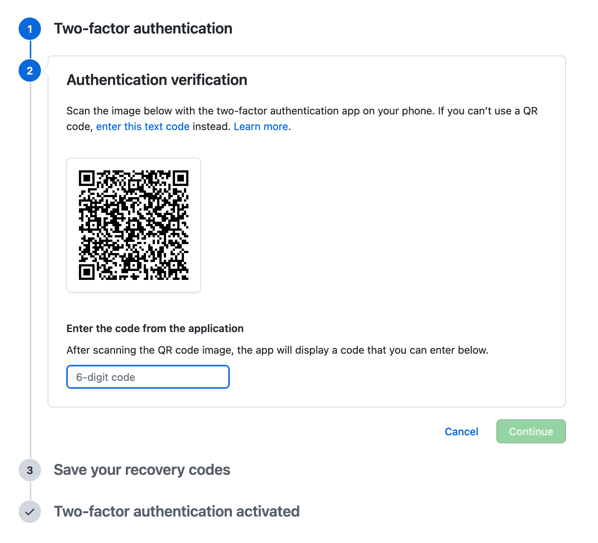

Once your QR code is scanned into the app, the app will provide you with a 6-digit code to enter back into github.com.

Github.com will now show you a list of **recovery codes** that you can use in case you lose access to your phone or authenticator app.
**Save these codes in a secure location, and do NOT share them, just like passwords!**
(This is why the screenshot below blacks out the recovery codes - they should not be shared!)
You can export these code by clicking the "Download" button.

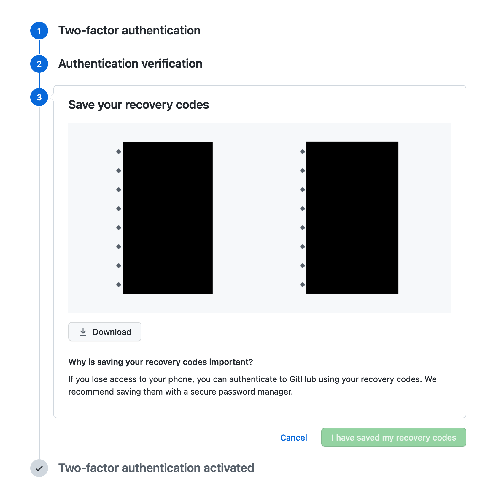

Once you have saved your recovery codes to a secure location, click "I have saved my recovery codes."

Celebrate your new 2FA setup!

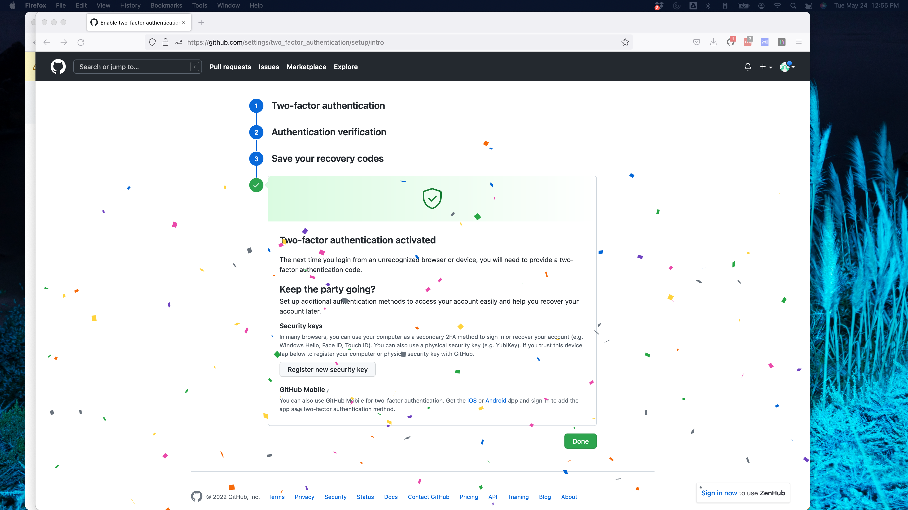

### 2FA with SMS

Enter your cell phone number and click "Send authentication code."

Shortly after, you will receive a text message with a 6-digit code which you should enter into the field "Enter the code sent to your phone."

Github.com will now show you a list of **recovery codes** that you can use in case you lose access to your phone or authenticator app.
**Save these codes in a secure location, and do NOT share them, just like passwords!**
(This is why the screenshot below blacks out the recovery codes - they should not be shared!)
You can export these code by clicking the "Download" button.

Once you have saved your recovery codes to a secure location, click "I have saved my recovery codes."

Celebrate your new 2FA setup!

